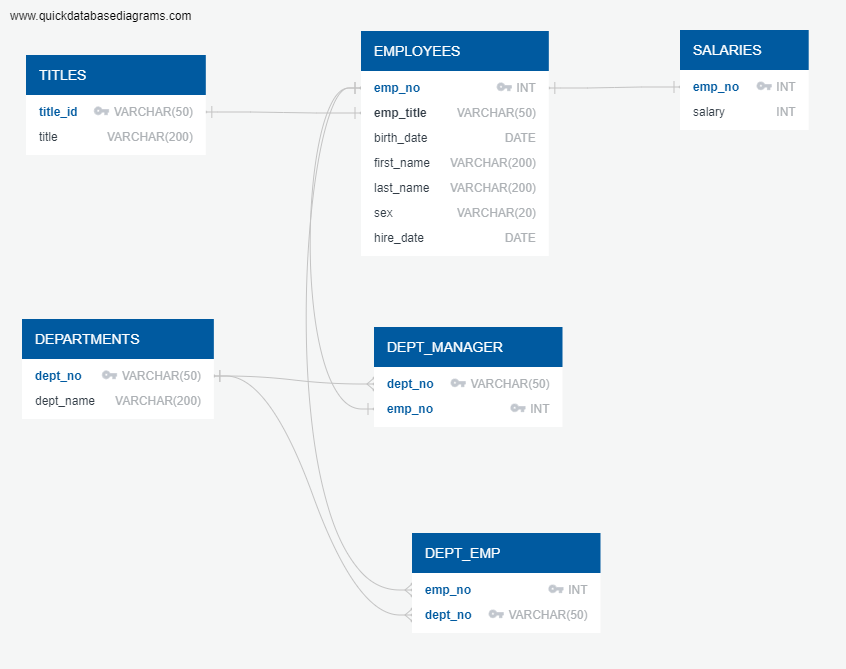

# SQL - EMPLOYEE DATABASE
PostgreSQL, data modeling, data engineering, and data analysis

## BACKGROUND 
It’s been two weeks since you were hired as a new data engineer at Pewlett Hackard (a fictional company). Your first major task is to do a research project about people whom the company employed during the 1980s and 1990s. All that remains of the employee database from that period are six CSV files.

For this project, you’ll design the tables to hold the data from the CSV files, import the CSV files into a SQL database, and then answer questions about the data. That is, you’ll perform data modeling, data engineering, and data analysis, respectively.

## DATA MODELING 
Inspect the CSV files, and then sketch an Entity Relationship Diagram of the tables

\

## DATA ENGINEERING
Use the provided information to create a table schema for each of the six CSV files. Be sure to do the following:

    Remember to specify the data types, primary keys, foreign keys, and other constraints.

    For the primary keys, verify that the column is unique. Otherwise, create a composite key 

    Links to an external site., which takes two primary keys to uniquely identify a row.

    Be sure to create the tables in the correct order to handle the foreign keys.

Import each CSV file into its corresponding SQL table.

```sql
CREATE TABLE "TITLES" (
    "title_id" VARCHAR(50)   NOT NULL,
    "title" VARCHAR(200)   NOT NULL,
    CONSTRAINT "pk_TITLES" PRIMARY KEY (
        "title_id"
     )
);

CREATE TABLE "EMPLOYEES" (
    "emp_no" INT   NOT NULL,
    "emp_title" VARCHAR(50)   NOT NULL,
    "birth_date" DATE   NOT NULL,
    "first_name" VARCHAR(200)   NOT NULL,
    "last_name" VARCHAR(200)   NOT NULL,
    "sex" VARCHAR(20)   NOT NULL,
    "hire_date" DATE   NOT NULL,
    CONSTRAINT "pk_EMPLOYEES" PRIMARY KEY (
        "emp_no"
     )
);

CREATE TABLE "SALARIES" (
    "emp_no" INT   NOT NULL,
    "salary" INT   NOT NULL,
    CONSTRAINT "pk_SALARIES" PRIMARY KEY (
        "emp_no"
     )
);

CREATE TABLE "DEPARTMENTS" (
    "dept_no" VARCHAR(50)   NOT NULL,
    "dept_name" VARCHAR(200)   NOT NULL,
    CONSTRAINT "pk_DEPARTMENTS" PRIMARY KEY (
        "dept_no"
     )
);

CREATE TABLE "DEPT_MANAGER" (
    "dept_no" VARCHAR(50)   NOT NULL,
    "emp_no" INT   NOT NULL,
    CONSTRAINT "pk_DEPT_MANAGER" PRIMARY KEY (
        "dept_no","emp_no"
     )
);

CREATE TABLE "DEPT_EMP" (
    "emp_no" INT   NOT NULL,
    "dept_no" VARCHAR(50)   NOT NULL,
    CONSTRAINT "pk_DEPT_EMP" PRIMARY KEY (
        "emp_no","dept_no"
     )
);

ALTER TABLE "EMPLOYEES" ADD CONSTRAINT "fk_EMPLOYEES_emp_title" FOREIGN KEY("emp_title")
REFERENCES "TITLES" ("title_id");

ALTER TABLE "SALARIES" ADD CONSTRAINT "fk_SALARIES_emp_no" FOREIGN KEY("emp_no")
REFERENCES "EMPLOYEES" ("emp_no");

ALTER TABLE "DEPT_MANAGER" ADD CONSTRAINT "fk_DEPT_MANAGER_dept_no" FOREIGN KEY("dept_no")
REFERENCES "DEPARTMENTS" ("dept_no");

ALTER TABLE "DEPT_MANAGER" ADD CONSTRAINT "fk_DEPT_MANAGER_emp_no" FOREIGN KEY("emp_no")
REFERENCES "EMPLOYEES" ("emp_no");

ALTER TABLE "DEPT_EMP" ADD CONSTRAINT "fk_DEPT_EMP_emp_no" FOREIGN KEY("emp_no")
REFERENCES "EMPLOYEES" ("emp_no");

ALTER TABLE "DEPT_EMP" ADD CONSTRAINT "fk_DEPT_EMP_dept_no" FOREIGN KEY("dept_no")
REFERENCES "DEPARTMENTS" ("dept_no");
```

All the data was imported using PGAdmin.

## DATA ANALYSIS
I created a view for each query for ease of recall.

1. List the employee number, last name, first name, sex, and salary of each employee.
```sql
CREATE VIEW employee_salary AS
SELECT "EMPLOYEES".emp_no, "EMPLOYEES".last_name, "EMPLOYEES".first_name, "EMPLOYEES".sex, "SALARIES".salary
FROM "EMPLOYEES"
RIGHT JOIN "SALARIES" ON
"EMPLOYEES".emp_no = "SALARIES".emp_no;

SELECT * FROM employee_salary;
```
2. List the first name, last name, and hire date for the employees who were hired in 1986
```sql
CREATE VIEW employees_1986 AS
SELECT first_name, last_name, hire_date
FROM "EMPLOYEES"
WHERE hire_date >= '1986-1-1' AND hire_date < '1987-1-1';

SELECT * FROM employees_1986;
```
3. List the manager of each department along with their department number, department name, employee number, last name, and first name.
```sql
CREATE VIEW department_managers AS
SELECT "DEPARTMENTS".dept_no, "DEPARTMENTS".dept_name, "DEPT_MANAGER".emp_no, "EMPLOYEES".last_name, "EMPLOYEES".first_name
FROM "DEPARTMENTS"
JOIN "DEPT_MANAGER"
ON "DEPARTMENTS".dept_no = "DEPT_MANAGER".dept_no
JOIN "EMPLOYEES"
ON "DEPT_MANAGER".emp_no = "EMPLOYEES".emp_no;

SELECT * FROM department_managers;
```
4. List the department number for each employee along with that employee’s employee number, last name, first name, and department name.
```sql
CREATE VIEW employee_departments AS
SELECT "DEPARTMENTS".dept_no, "DEPT_EMP".emp_no, "EMPLOYEES".last_name, "EMPLOYEES".first_name,  "DEPARTMENTS".dept_name
FROM "DEPARTMENTS"
JOIN "DEPT_EMP"
ON "DEPARTMENTS".dept_no = "DEPT_EMP".dept_no
JOIN "EMPLOYEES"
ON "DEPT_EMP".emp_no = "EMPLOYEES".emp_no;

SELECT * FROM employee_departments;
```
5. List first name, last name, and sex of each employee whose first name is Hercules and whose last name begins with the letter B.
```sql
CREATE VIEW hercules_b AS
SELECT first_name, last_name, sex
FROM "EMPLOYEES"
WHERE first_name = 'Hercules'
AND last_name LIKE 'B%';

SELECT * FROM hercules_b;
```
6. List each employee in the Sales department, including their employee number, last name, and first name.
```sql
CREATE VIEW sales_employees AS
SELECT "DEPARTMENTS".dept_name, "EMPLOYEES".emp_no, "EMPLOYEES".last_name, "EMPLOYEES".first_name
FROM "DEPT_EMP"
JOIN "EMPLOYEES"
ON "DEPT_EMP".emp_no = "EMPLOYEES".emp_no
JOIN "DEPARTMENTS"
ON "DEPT_EMP".dept_no = "DEPARTMENTS".dept_no
WHERE "DEPARTMENTS".dept_name = 'Sales';

SELECT * FROM sales_employees;
```
7. List each employee in the Sales and Development departments, including their employee number, last name, first name, and department name.
```sql
CREATE VIEW sales_development_employees AS
SELECT "EMPLOYEES".emp_no, "EMPLOYEES".last_name, "EMPLOYEES".first_name, "DEPARTMENTS".dept_name
FROM "DEPT_EMP"
JOIN "EMPLOYEES"
ON "DEPT_EMP".emp_no = "EMPLOYEES".emp_no
JOIN "DEPARTMENTS"
ON "DEPT_EMP".dept_no = "DEPARTMENTS".dept_no
WHERE "DEPARTMENTS".dept_name = 'Sales' 
OR "DEPARTMENTS".dept_name = 'Development';

SELECT * FROM sales_development_employees;
```
8. List the frequency counts, in descending order, of all the employee last names (that is, how many employees share each last name).
```sql
CREATE VIEW last_name_count AS
SELECT last_name,
COUNT(last_name) AS frequency_count
FROM "EMPLOYEES"
GROUP BY last_name
ORDER BY frequency_count DESC;

SELECT * FROM last_name_count;
```


